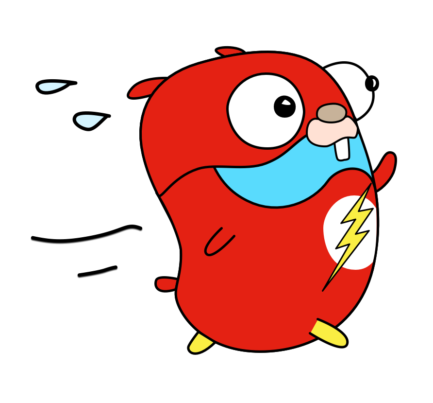

# Golang API starter



## Development

Run the development server:

```bash
./run watch # or ./run docker-watch
```

## Production

Build the project:

```bash
./run build
```

Run the production server:

```bash
./run start
```

## Notes

- The `run` file is the project's task runner script. Run `./run` to see the available commands.
- The config & secrets should be stored in the `.env` file in the `.local` directory. If you want to use a different file, you can specify it using the `ENV_FILE` environment variable.
- If build fails due to an error in parsing 'default.pgo', you can delete the file and run `./run build` again.
